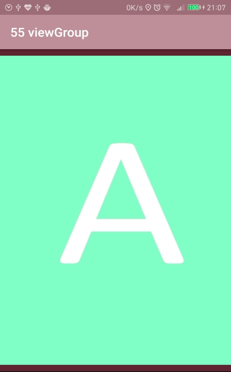
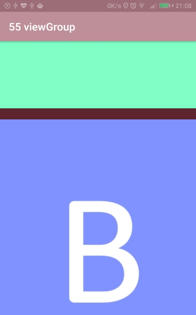

# view-group
view group (改自Android 群英傳例題)

每個view佔一屏，每一屏各放一張圖片，
所有view加入一個view group一起管理。

view group中重寫onMeasure()對子view進行測量。
view group中重寫onLayout()確定子view的位置。
view group中重寫onTouchEvent()實現垂直滾動的邏輯，還有黏性的邏輯
*黏性：垂直滾動不超過1/3屏，touch up後會彈回原屏；若超過1/3屏，則會彈到下一屏。

↓ 第一個view 

↓ 滾動超過1/3屏後放手 

↓ 彈到第二屏 

App download ↓  
https://drive.google.com/open?id=0B0csiWXavBDHaWNHRjh1Rl9PQ2c
